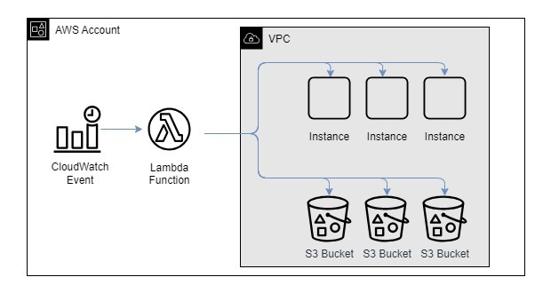
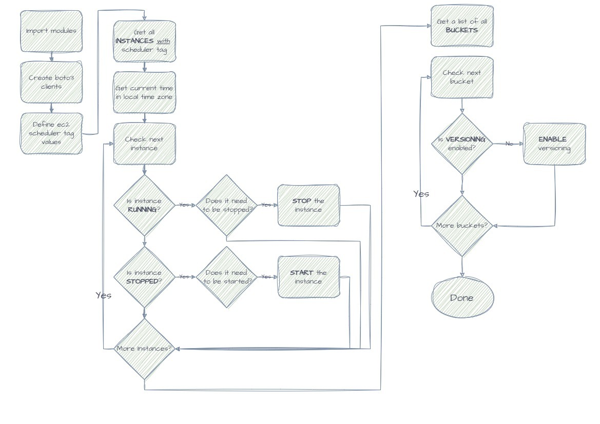

# Hands-on Boto3, Lambda: Implement EC2 Scheduler & S3 Compliance Checker

Purpose of this hands-on training is to provide additional exposure to Boto3 and Lambda to develop an EC2 Scheduler and S3 compliance validator.  The scheduler will stop instances after hours and restart them at the beggining of the day.  The S3 compliance validator will ensure that all S3 buckets in the account have versioning enabled, to remain compliant with the company's storage policies.  These are practical problems that are faced in organizations today.

## Architecture

## Application Flow

## At the end of the this hands-on training, students will be able to:

- create a Lambda function and necessary roles and policies

- be able to use the boto3 SDK, specifically with the 'EC2' resource

- parse json output from AWS using boto3

- write a python script from scratch
